# Technical Architecture

This document provides a detailed technical overview of the Launchpad application architecture, including system design, data flows, and deployment architecture.

## Table of Contents

1. [System Architecture](#system-architecture)
2. [Component Architecture](#component-architecture)
3. [Data Flow](#data-flow)
4. [Routing Architecture](#routing-architecture)
5. [State Management](#state-management)
6. [Render Deployment Architecture](#render-deployment-architecture)
7. [Build Process](#build-process)

## System Architecture

### High-Level Overview

The application follows a **client-server architecture** optimized for static hosting with API capabilities:

```
┌─────────────────────────────────────────────────────────────┐
│                        Client (Browser)                      │
│  ┌──────────────────────────────────────────────────────┐  │
│  │              React Application (SPA)                 │  │
│  │  ┌──────────┐  ┌──────────┐  ┌──────────┐          │  │
│  │  │Launchpad │  │SnakeGame │  │Platformer│  ...      │  │
│  │  └──────────┘  └──────────┘  └──────────┘          │  │
│  │         │              │              │              │  │
│  │         └──────────────┼──────────────┘              │  │
│  │                        │                             │  │
│  │              ┌─────────▼─────────┐                    │  │
│  │              │  React Router    │                    │  │
│  │              │  (Client-side)   │                    │  │
│  │              └──────────────────┘                    │  │
│  └──────────────────────────────────────────────────────┘  │
│                        │                                    │
│                        │ HTTP Requests                      │
└────────────────────────┼────────────────────────────────────┘
                         │
                         ▼
┌─────────────────────────────────────────────────────────────┐
│                    Server (Express.js)                       │
│  ┌──────────────────────────────────────────────────────┐  │
│  │              Static File Server                       │  │
│  │              (serves dist/)                           │  │
│  └──────────────────────────────────────────────────────┘  │
│  ┌──────────────────────────────────────────────────────┐  │
│  │              API Routes (/api/*)                      │  │
│  │  ┌──────────┐  ┌──────────┐  ┌──────────┐            │  │
│  │  │ /health  │  │ /future  │  │ /routes  │  ...       │  │
│  │  └──────────┘  └──────────┘  └──────────┘            │  │
│  └──────────────────────────────────────────────────────┘  │
│  ┌──────────────────────────────────────────────────────┐  │
│  │         Catch-all Route (*)                           │  │
│  │         (serves index.html for SPA)                   │  │
│  └──────────────────────────────────────────────────────┘  │
└─────────────────────────────────────────────────────────────┘
```

### Architecture Diagram

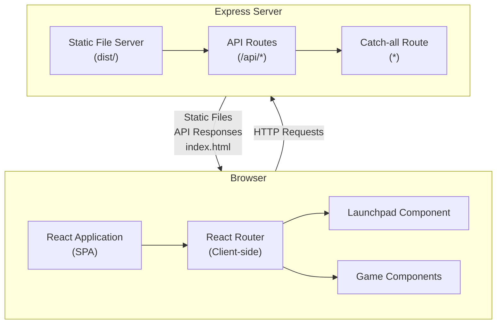

## Component Architecture

### Component Hierarchy

```
App (Root)
├── ThemeProvider (Context)
│   └── Router (React Router)
│       ├── Route: / → Launchpad
│       │   ├── HamburgerMenu
│       │   │   └── ThemeToggle
│       │   └── AppCard[] (for each app)
│       ├── Route: /snake → SnakeGame
│       │   └── HomeButton
│       └── Route: /platformer → PlatformerGame
│           └── HomeButton
```

### Component Relationships

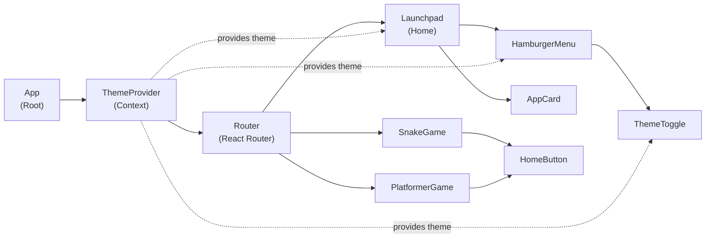

## Data Flow

### Theme State Flow

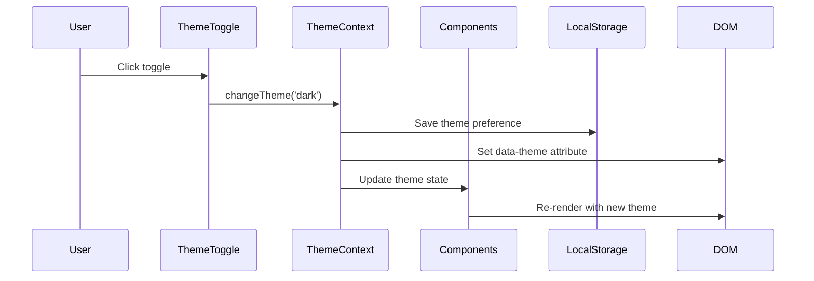

### Navigation Flow

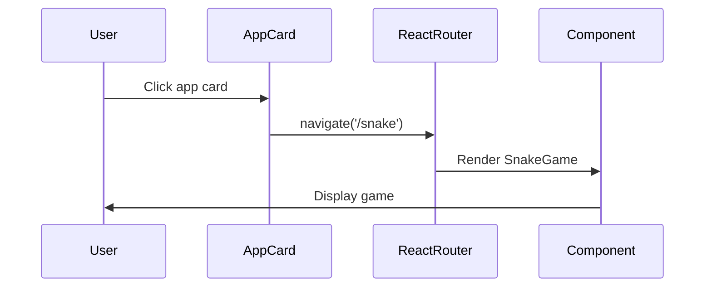

### App Registry Flow

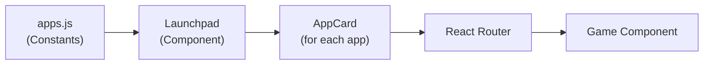

## Routing Architecture

### Frontend Routing (Client-Side)

React Router handles all client-side navigation:

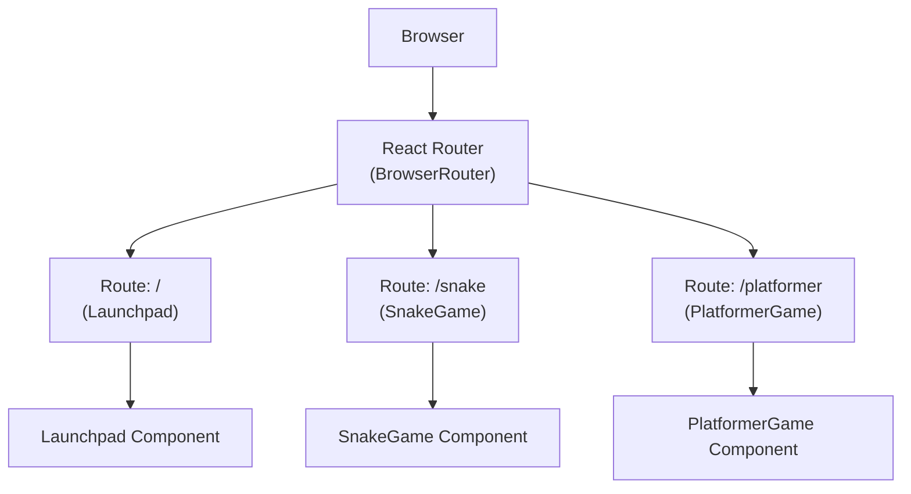

### Backend Routing (Server-Side)

Express handles API routes and serves static files:

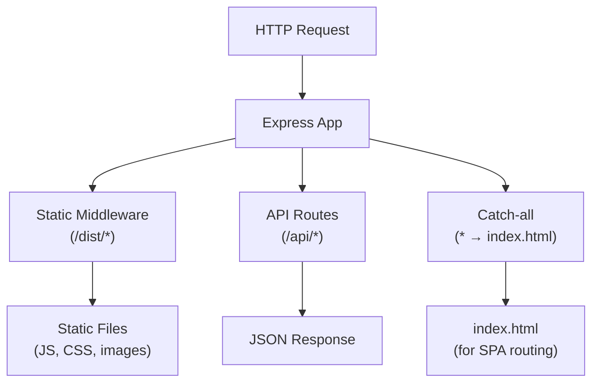

### Route Resolution Flow

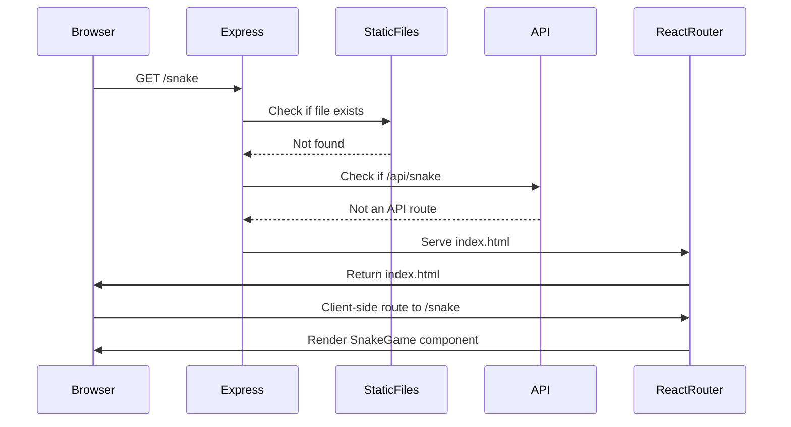

## State Management

### Current State Management Approach

The application uses a **minimal state management** approach:

1. **Local Component State**: `useState` for component-specific state
2. **Context API**: `ThemeContext` for global theme state
3. **URL State**: React Router for navigation state

### State Management Diagram

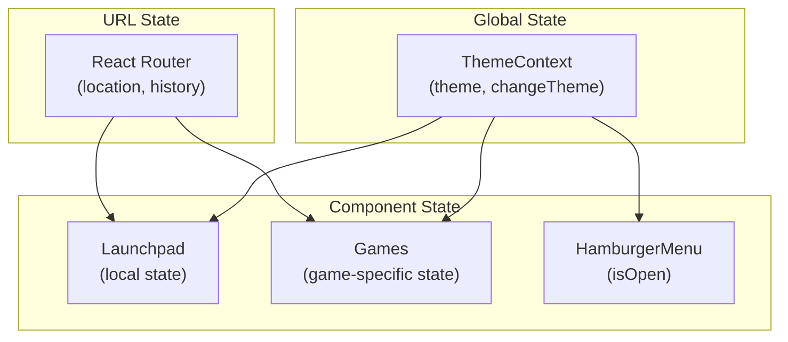

## Render Deployment Architecture

### Deployment Flow

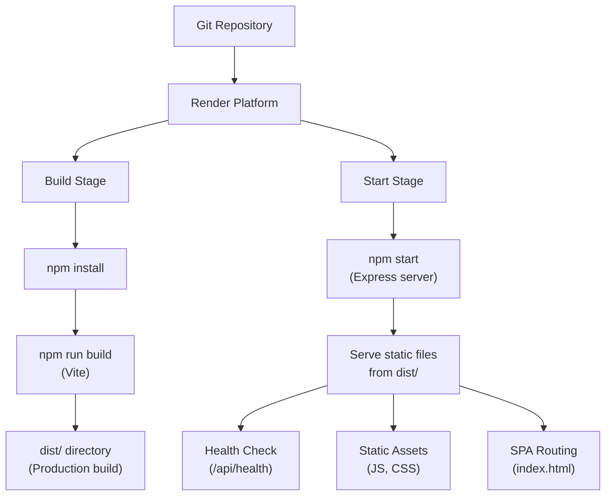

### Render Environment Architecture

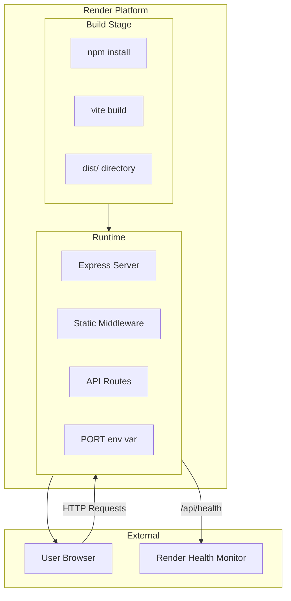

### File Structure on Render

```
/app (Render container)
├── dist/                    # Vite build output
│   ├── index.html
│   ├── assets/
│   │   ├── index-[hash].js
│   │   └── index-[hash].css
│   └── ...
├── server/                  # Express server code
│   ├── config/
│   ├── routes/
│   └── server.js
├── src/                     # Source code (not needed at runtime)
├── package.json
├── package-lock.json
└── render.yaml
```

## Build Process

### Development Build (Vite Dev Server)

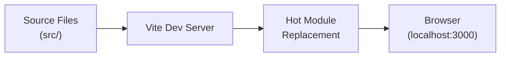

### Production Build (Vite Build)

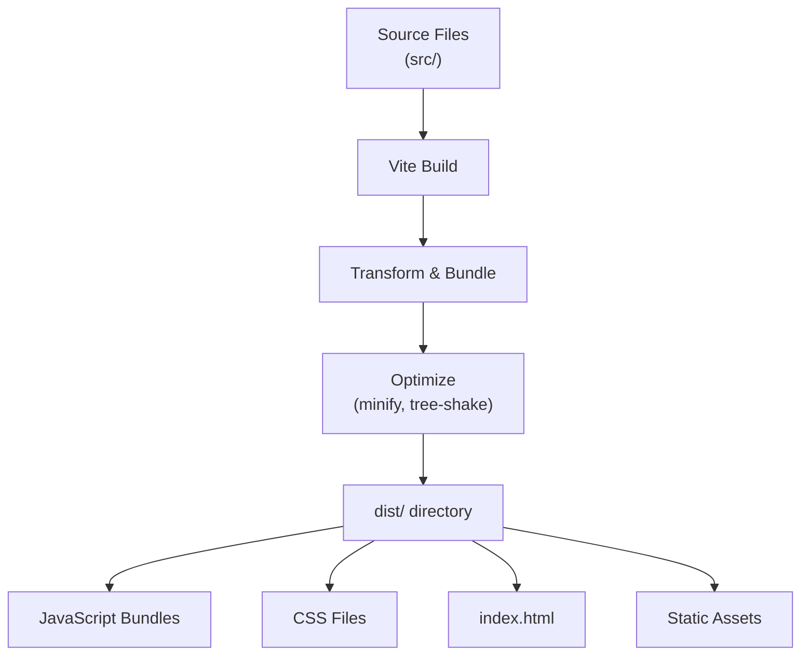

### Build-to-Serve Pipeline

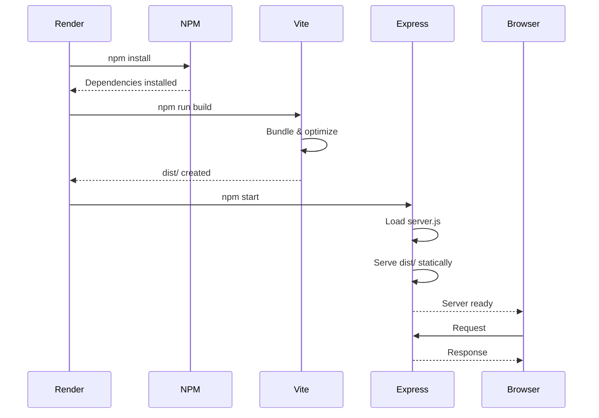

## Key Architectural Decisions

### 1. Build-Then-Serve Pattern

**Decision**: Use Vite to build React app, then Express serves static files.

**Rationale**:
- Optimized production bundles
- Simple deployment on Render
- Clear separation of build and runtime

### 2. Client-Side Routing

**Decision**: Use React Router for all navigation.

**Rationale**:
- Single Page Application (SPA) benefits
- Fast navigation without page reloads
- Simple catch-all route in Express

### 3. Minimal State Management

**Decision**: Use Context API only for theme, useState for local state.

**Rationale**:
- Simple applications don't need complex state management
- Easy to add Redux/Zustand later if needed
- Reduces complexity and dependencies

### 4. Centralized Configuration

**Decision**: Centralize routes and app registry in constants.

**Rationale**:
- Single source of truth
- Easy to maintain and update
- Prevents route/app mismatches

### 5. Organized Server Structure

**Decision**: Organize server code into routes/, config/, middleware/.

**Rationale**:
- Scalable for future API endpoints
- Clear separation of concerns
- Easy to find and modify code

## Future Architecture Considerations

### Potential Enhancements

1. **State Management**: Add Redux or Zustand if state becomes complex
2. **API Layer**: Add API client abstraction if more endpoints are added
3. **Error Handling**: Add error boundaries and global error handling
4. **Testing**: Add unit tests, integration tests
5. **Performance**: Add code splitting, lazy loading for games
6. **PWA**: Add service workers for offline support

### Scalability Path

```
Current: Simple SPA with minimal state
    ↓
Add: More games, more state
    ↓
Consider: State management library
    ↓
Add: Backend features, user accounts
    ↓
Consider: Database, authentication
    ↓
Add: Real-time features
    ↓
Consider: WebSockets, server-sent events
```

